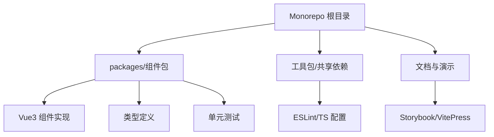
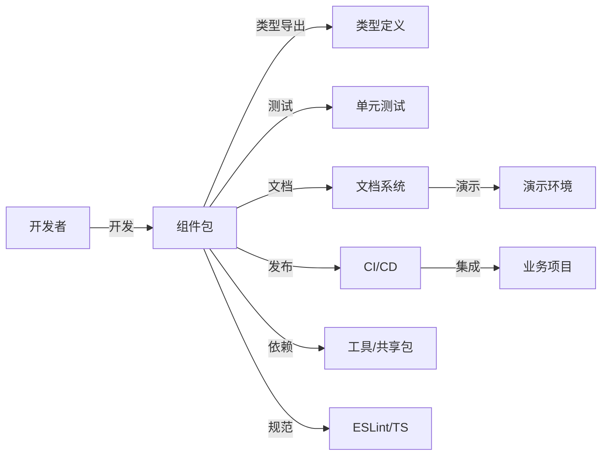
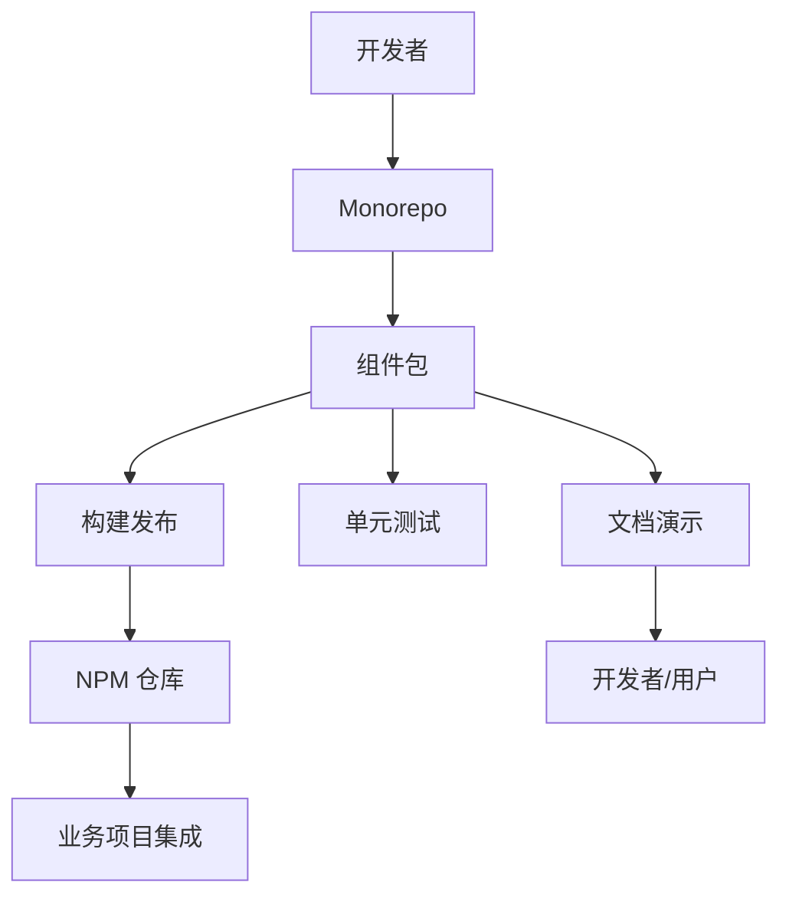

# daoda-component 前端组件库架构设计文档

## 一、系统层次结构



- Monorepo 根目录：统一管理所有包与依赖，配置 pnpm workspace 与 lerna
- packages/组件包：每个组件独立维护，支持按需引入
- 工具包/共享依赖：存放工具函数、类型、主题等
- 文档与演示：组件文档与交互演示，支持在线预览
- 组件实现：Vue3 + TypeScript，严格类型安全
- 类型定义：每个包导出完整类型，禁止 any
- 单元测试：每个包独立测试，保证质量
- 配置：统一 ESLint/TS 规则，集成到各包

## 二、组件交互图



## 三、数据流图



## 四、技术栈细节及版本

- Vue3 (Composition API)
- TypeScript（严格模式，禁止 any）
- pnpm（包管理，workspace）
- lerna（多包版本与发布）
- eslint-plugin-vue + @typescript-eslint（代码规范）
- Vitest（单元测试）
- Storybook 或 VitePress（文档与演示）
- husky + lint-staged（提交前校验）
- CI/CD（GitHub Actions/其他）

## 五、关键 API 设计

### 1. 组件导出与类型

```typescript
// 组件包入口
export { default as Button } from "./Button";
export type { ButtonProps } from "./Button/type";
```

### 2. 工具与主题

```typescript
// 工具函数
export * from "../utils";
// 主题变量
export * from "../theme";
```

### 3. 统一类型安全

```typescript
// 禁止 any，所有类型需明确定义
interface ExampleProps {
  label: string;
  size?: "small" | "medium" | "large";
}
```

## 六、数据模型与架构

- 组件包结构：每个包包含 src、types、test、docs 等目录
- 类型定义：所有 props、事件、暴露 API 均有类型
- 配置文件：根目录统一管理 ESLint、TS、pnpm、lerna 配置
- 依赖关系：各包通过 workspace 互相依赖，版本统一

## 七、状态管理策略

- 组件内部状态通过 props/emits 管理
- 不引入全局状态库，保持组件独立性
- 主题/配置通过 provide/inject 或全局 context 传递

## 八、安全设计考量

- 严格禁止 any 类型，所有类型需明确定义
- ESLint/TS 校验集成 CI，提交前自动检查
- 依赖锁定，防止依赖污染
- 组件 props 校验与默认值

## 九、性能优化设计

- 按需打包与导出，支持 tree-shaking
- 组件懒加载与异步导入
- 文档与演示环境分离，减小主包体积
- 单元测试与类型测试保障质量

## 十、架构演进与扩展性

- 支持新组件包快速接入
- 统一脚本与模板，提升开发效率
- 预留国际化、主题切换等扩展点
- 支持多端适配与未来生态扩展
