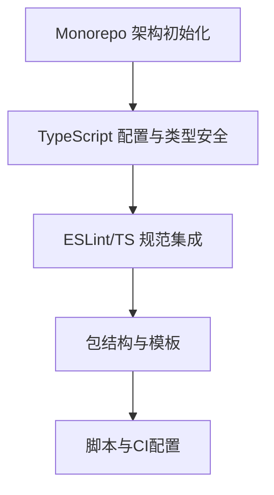

# Epic: 组件库基础架构与规范

## 整体目标

搭建基于 Monorepo（pnpm+lerna）的 Vue3+TypeScript 组件库基础架构，统一开发规范，集成 ESLint/TS 检查，确保类型安全与高可维护性，为后续组件开发提供坚实基础。

## 业务价值

- 降低多包管理与协作复杂度，提升开发效率
- 保证代码风格、类型安全和质量一致性
- 支持企业级和个人开发者高效集成与二次开发
- 为持续扩展和生态建设打下基础

## 验收标准

- 完成 Monorepo 架构初始化（pnpm workspace + lerna）
- 配置 TypeScript 严格模式，禁止 any
- 集成 eslint-plugin-vue + @typescript-eslint 规则
- 完成统一的包结构模板
- 提供基础开发、测试、发布脚本
- 通过所有 ESLint/TS 检查

## 关键约束

- 所有包和组件必须类型安全，禁止 any
- 统一依赖与版本管理，防止依赖污染
- 代码提交前自动校验（husky + lint-staged）
- 需支持后续新包/新组件快速接入

## 功能列表及状态

- Monorepo 架构初始化（待办）
- TypeScript 配置与类型安全（待办）
- ESLint/TS 规范集成（待办）
- 包结构与模板（待办）
- 脚本与 CI 配置（待办）

## 优先级

P0（必须）

## 依赖关系

