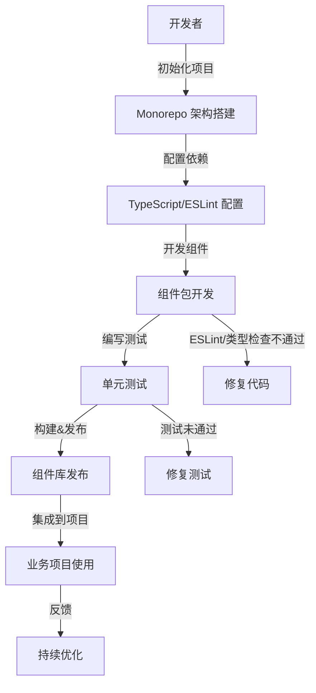

# daoda-component 前端组件库 PRD

## 项目目标

打造一套基于 Vue3 + TypeScript 技术栈的高质量前端组件库，采用 Monorepo 架构（pnpm + lerna）进行多包依赖管理，集成 eslint-plugin-vue 与 @typescript-eslint 规则，严格禁止 any 类型，助力企业级与个人开发者高效构建现代 Web 应用。

## 问题与解决方案

- **问题**：现有组件库多为单包结构，类型安全性不足，团队协作与包管理复杂，代码规范不统一，难以满足大型项目的可维护性与扩展性需求。
- **解决方案**：采用 Monorepo 架构，统一依赖与版本管理，集成严格的 ESLint 规则，全面禁止 any 类型，提升类型安全与代码质量，提供丰富的高可用 Vue3 组件，支持按需引入与二次开发。

## 任务序列

1. 需求分析与 PRD 编写（本文件）
2. 架构设计与技术选型
3. Monorepo 项目初始化（pnpm + lerna）
4. 配置 TypeScript、ESLint（eslint-plugin-vue + @typescript-eslint）
5. 组件开发与单元测试
6. 文档与演示环境搭建
7. 持续集成与发布流程配置
8. 组件库发布与维护

## 技术决策与约束

- 架构模式：Monorepo（pnpm + lerna）
- 组件开发：Vue3 + TypeScript
- 代码规范：eslint-plugin-vue + @typescript-eslint，禁止 any 类型
- 包管理：pnpm workspace
- 版本管理：lerna
- 测试框架：Vitest 或 Jest
- 文档系统：VitePress 或 Storybook
- 约束：所有包与组件均需类型安全，禁止 any，需通过严格 ESLint 检查

## 关键用例流程图

## 主要用户角色

- 组件库开发者：负责组件开发、维护与发布
- 业务开发者：集成并使用组件库，反馈问题与建议

## 关键交互步骤

- Monorepo 初始化、依赖配置、组件开发、单元测试、文档编写、发布与集成、问题反馈与持续优化

## 决策分支与条件路径

- 组件开发：每个组件包独立维护，统一规范
- 类型检查：所有包必须通过 ESLint 与 TypeScript 检查，禁止 any
- 测试流程：组件发布前必须通过全部单元测试
- 发布流程：通过 CI/CD 自动化发布
- 异常处理：类型/规范/测试不通过需修复后方可发布

## 错误处理流程

- 依赖安装/构建/测试/发布等流程如遇错误，终止流程并输出详细日志，开发者修复后重试
- 组件库如遇类型或 ESLint 错误，禁止发布，需修复后重新检查
